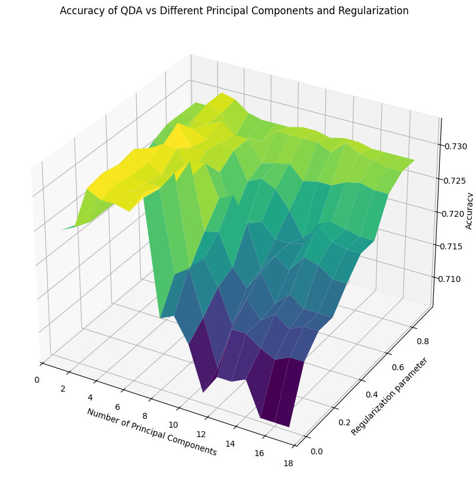
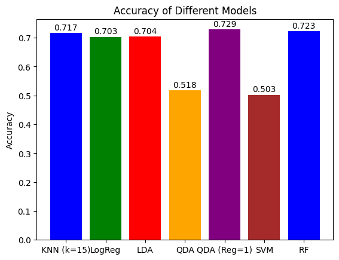
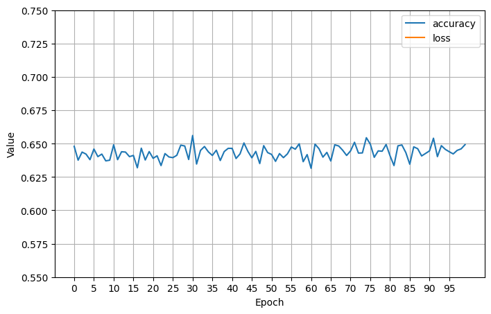
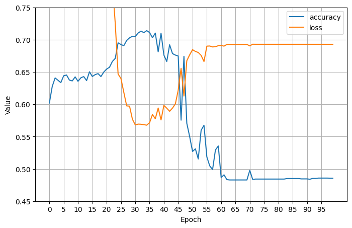
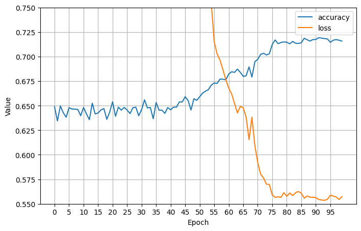
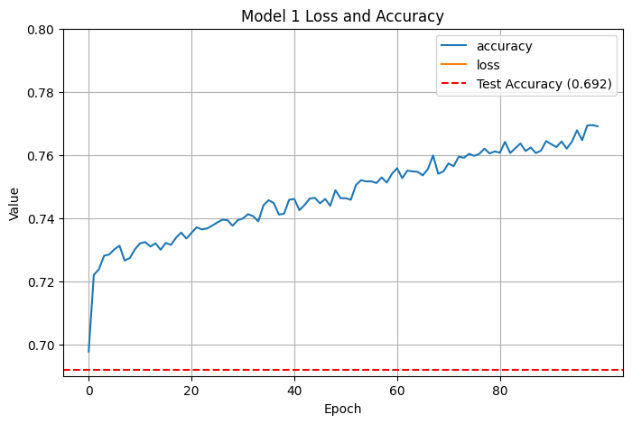
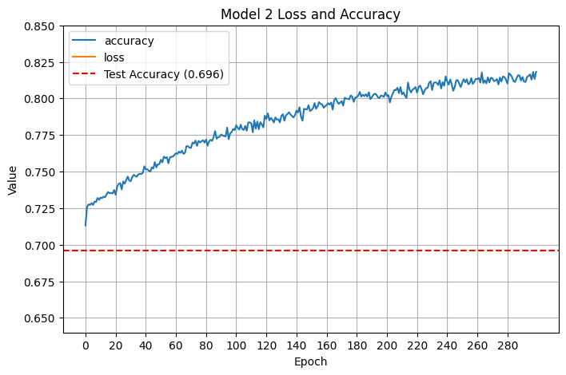
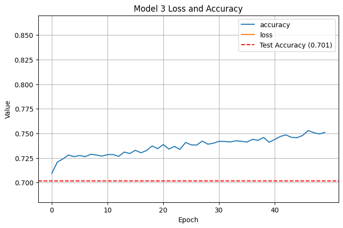
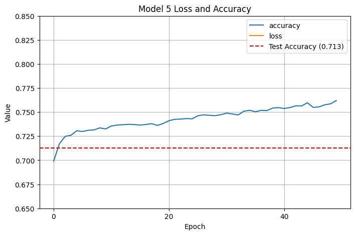

# League of Losers

_Predicting winners and losers in League of Legends games with Python, sklearn, and tensorflow_

## Overview

League of Legends is an online multiplayer game where two teams of 5 players each select unique characters (called "champions") and fight to destroy the other team's base on a three-lane map. The typical roles are top laner, jungler, mid laner, bot laner, and support. Players can (temporarily) kill each other or kill smaller enemies (called "minions") to receive gold and experience that powers up their characters. There are also neutral objectives teams can fight to kill, like Dragons or Rift Heralds, that provide the team that kills it a meaningful bonus. League of Legends has a fog of war, so teams need to compete using asymmetric information (which can be aided by placing wards, which reveal part of the map for one team). Games typically last from 30 to 50 minutes.

## Data Set

This [data set](https://www.kaggle.com/datasets/bobbyscience/league-of-legends-diamond-ranked-games-10-min) is essentially a snapshot of each team's statistics at 10 minutes, and our goal is to **predict which team wins** based of game features. These features include relative and absolute gold, average team level and total experience, team kills, team assists, team deaths, dragon and herald kills, information about wards, and so on.

This data set also represents games from the Diamond rank, which is roughly the top 5-2% of players, so this roughly captures players who are all at the same skill level. Importantly, predictive features in the data will be more obvious at high levels of play where competent teams will be more able to press leads and leverage advantages than players at low skill levels. However, this skill level isn't _too_ high to restrict our sample size.

### Limitations and Expected Accuracy

We're missing several key pieces of data:

- We don't know **which champions players are picking**. Even individual champion picks and matchups can often predict winrate as high as 60% accuracy, and team composition is also crucial for winning games. There were approximately 150 champions in League of Legends at the time this data set was recorded, so it's effectively impossible to get representative data on every team composition and matchup, but champions have very clearly defined matchups and their in-game functions often fall into distinct buckets, so team composition data could still be highly predictive with several thousand games. Some champions are also very effective at accruing resources, and some champions are very effective at using resources, so this would highly impact the usefulness of metrics like gold or experience difference.
- We don't know **what each player's Elo score is**. [Elo scores](https://en.wikipedia.org/wiki/Elo_rating_system) are used to rank the relative skill of players, and can sometimes vary widely: players both above and below the Diamond rank may appear on opposite teams, and that may place one team at an unfair (dis)advantage. Elo differences, especially between opponents in the same role, infamously predict the outcomes of games.
- We don't know **how resources are distributed**. If a team has 3 deaths by 10 minutes, are those deaths spread out or all caused by a single player? This is very important for understanding how the team is doing overall, especially because different champions benefit from kills or suffer from deaths more than others.
- We don't have **time series data**. If a team has 3 kills, did they get all 3 of those kills at once, or did they get them at different times? Getting many kills at once often provides teams with time to pursue other objectives on the map and press their lead more effectively than if the kills happened at different times. Time series data paints a much deeper picture of how the game is actually going, and it's a shame we don't have it. Additionally, dying at a bad time may give the opposing team a big advantage for a fight over a neutral resource, like Dragon or Rift Herald.

The most crucial piece of data we're missing is that we only have **data for the first ten minutes of the game**. Of course, we would have to pick some time stamp to make our cutoff, but even if we had all the above features and a huge number of samples, we'd still always have error: players might disconnect, game win time is not fixed and might vary widely, champion winrates vary over time, players may be good at playing early but make poor decisions later on, and so on.

However, a saving grace is that League of Legends has _snowballing_: having resources in the present makes it easier to get resources in the future. This is unlike football for example, where one team scoring a goal does not change the rules of the game to make scoring future goals easier. (Although it still may help predict which team is more skilled.) This means that limiting our data set to the first ten minutes _doesn't_ harm our analysis that badly: **what happens in the first ten minutes should very meaningfully predict the outcome of the game, even though we are missing many features**. My initial guess was that it would be too difficult to get accuracy higher than 85% (and, having revisited this section, I would say our expected accuracy should be even lower) but we should expect to do meaningfully better than a coinflip: anything less than 65% is underperforming. To conclude, **I aimed for accuracy between 65% to 85%**.

## Exploratory Analysis

Many features, like game ID, have no influence on the game whatsoever, so we can drop it. Other features, like `redGoldDiff` and `redExperienceDiff`, are simply the negation of `blueGoldDiff` and `blueExperienceDiff`, so they can be safely dropped. Surprisingly, `blueKills` and `redDeaths` matched in every single game (even though this is not necessarily true: players can die without being killed by another player) so they could be dropped. Finally, some features were redundant: `blueEliteMonsters = blueDragons + blueHeralds` and `blueGoldPerMin = blueTotalGold / 10` in every single game, so we can drop them. (The same is true of the stats for the red team.)

After that, it was time to just get some initial data: I eliminated 10 features and got down to **30 features** (including the target variable). There was also no missing data, so I had **9879 samples**.

I was also interested to see if the blue team's winrate of 49.9 was unusual: it looked extremely normal, but sometimes for large $n$ a deviation of even .1% can be weird, and I felt like it was good to practice. I calculated a $z$-score of about $-0.191$ yielding a $p$-value $0.848$, so we fail to reject the null hypothesis. In other words, the blue team's slightly higher number of losses is well within a normal range.

From there, it was on to the correlation heatmap. I multiplied all the values by 10 to make them easier to read:

We can see that the most highly correlated features are `blueGoldDiff` (.51), `blueExperienceDiff` (.49), `blueTotalGold` (.42), `blueTotalExperience` (.39), `blueAvgLevel` (.36), and `blueKills` (.34); everything else had a correlation below .3. The most negatively correlated features were the same features for the red team, so things like `redTotalGold` (-0.41), and the red features were almost exactly $-1$ times the blue features! No surprises here. Values about wards had the smallest absolute correlation, with values all less than 0.1.

### Clustering

From there, I did a basic k-means clustering to see if the games tended to fall into similar categories. There appeared to be an elbow point at $k = 5$, so I decided to analyze those clusters.

_Inertia vs number of clusters_

Just looking at win rate, the clusters seemed to roughly describe:

- games where the blue team is favored, but there's still a 22% chance the red team wins
- games where both teams start out relatively close (but skews slightly blue)
- games where the red team is favored, but there's still a 27% chance the blue team wins
- games where the blue team gets a terrible start and has a >90% chance to lose
- games where the red team gets a terrible start and has a >93% chance to lose

Interestingly, the blue team won only 49.9% of their games across the entire data set, but seem to have a 53.0% chance to win in the "close" games.

Further investigation showed that towers destroyed seemed to have the highest correlation with cluster categorization. Experience and gold had much smaller absolute correlations, and the number of wards destroyed had a very strong negative correlation.

Looking at each cluster individually, a random forest analysis of each feature's importance to the cluster put gold and experience metrics at the top for each one.

Putting the correlation and random forest analysis together, this likely means that gold and experience mattered in every cluster (hence had a low correlation with specific cluster placement) but the things that differentiated a _stomp_ from another game were the number of towers destroyed.

## Supervised Learning

From there, it was time to actually start making predictions. After performing a train test split, I first trained k-nearest on $k$ values from 1 to 20. The accuracy trended up and peaked at $k=15$, but I would prefer $k=9$ because it's lower while still having an accuracy above $.7$. I was hoping for a clear elbow point or better accuracy with lower $k$ values, and I feel like given the trend of the graph $k=15$ the best (instead of $k=16, 17, 18, 19$) is likely spurious.

The only other model I trained with a hyperparameter was QDA. Neither class's covariance matrix had full rank, (which produced terrible accuracy) so I experimented with different regularization parameters $0.1, 0.2, ..., 1.0$, and either $.7$ or $1.0$ ended up having the best accuracy. (The most recent time, it was $.7$.)

I also went through the standard battery of logistic regression, linear discriminant analysis, random forest, and a support vector machine:

QDA ended up being the most accurate at $.731$ (though logistic regression and LDA were not too far behind at roughly $.7$ each), and the support vector machine was downright terrible with an accuracy of only $.503$; basically a coinflip!

The thing I had most wanted to improve was working with neural networks in tensorflow, so I decided to train them iteratively and see if I could crack QDA's accuracy.

The first two neural networks had NaN loss using stochastic gradient descent; after trying to tweak the learning rate, I gave Adam a try instead and got a somewhat uninspiring initial fit ($.671$ test accuracy):

I added more epochs, which didn't help (still $.671$ test accuracy):

I added in some nonlinear (relu) layers and finally saw an increase in training accuracy, followed by an unfortunate crash down below 50% training accuracy, ultimately resulting in only $.503$ test accuracy:

I went back to tweaking the learning rate. My first attempt saw no increase in test accuracy, and training accuracy was still crashing:

An even smaller learning rate did actually fix our crashing accuracy problem and brought learning and test accuracy up to $0.710$:

Increasing the neurons per layer unfortunately brought back our accuracy issues, and we got test accuracy crashing back down to $0.497$:

Switching back to fewer neurons per layer and instead just deepening the network with more linear and nonlinear layers helped, and got test accuracy up to $.726$:

Accuracy seemed to be roughly capping out and I wasn't sure what else to tweak, so this where I chose to stop.

## Supervised Learning with Principal Components

The dimensionality of our data was still relatively high even after dropping many features, so I decided to perform principal component analysis. (I also wanted to do a better job than I did on my previous project.) It took only 17 components to explain 95% of the variance.

I decided to manually review each of the principal components; these were my interpretations:

- **Component 0** seems to be relative resources (gold diff and experience diff) and absolute resources (blue total gold, blue gold per min, blue total experience, and blue average level) with some smaller coefficients for other stats. Notably it has low correlation with dragons, heralds, jungle monsters, etc, and a moderate negative correlation with red team assists, kills, average level, total experience, gold per min, and total gold. Seems to be a **rough proxy for team lead**.

- **Component 1** cares about how many kills and assists were on both teams, but stats about how much absolute gold each team had. Coefficients drop off steeply, and seems to have moderate negative correlation with jungle stats and minions. Seems to very clearly be representing **how much kill gold each team has.**

- **Component 2** measures total experience and average level, with some info on absolute gold and how many minions have been killed. Seems to care a tiny amount about assists and jungle minions. Since all correlations are positive, it **might be overall level and resources available to _both_ teams.**

- **Component 3** has the strongest absolute correlations seen so far with how many dragons the red team has taken (+0.56) and how many dragons the blue team has taken (-0.56); note that these are the same numbers with the sign flipped. Slight positive correlation with blue minion features and slight negative correlation with red minion features (with opposite signs from their team's dragon features). Seems to clearly represent **which team gets an early dragon**; reversed correlation with minions may indicate that **if teams are not taking minions, they may be angling for an early dragon.**

- **Component 4** is clearly related to which team got the herald, and we see the same pattern as with component 3: redHerald (+0.465) and blueHerald (-4.13), with moderate affinity for red jungle minions killed. Slight affinity for how many towers the red team has destroyed and how many assists and kills the blue team has. Not sure about those low correlations, or why redWardsDestroyed has a moderate negative coefficient, but this seems to be **which team gets the herald**.

- **Component 5** is weird because it cares about how many wards the blue team has destroyed, which exploratory data analysis has indicated matters very little. It also has blue cs per minute and blue total minions killed, and _red_ team heralds, so this **may roughly indicate how well the blue bot lane is doing** (although we would expect maybe a stronger correlation with blue dragons than .155, but component 3 may be monopolizing that). Because it ranks blue wards destroyed so highly, this may be where we start getting diminishing returns.

- **Component 6** is another one that cares about wards, this time both team's wards. Despite a strong negative affinity for blue total jungle minions and other features, this is likely **vision control**.

- **Component 7** cares about how may red jungle minions are killed and whether blue got a first blood and early dragon, and is negatively correlated with how many towers the red team destroyed. This seems to correlate with **the red team's early jungle presence**.

- **Component 8** screams about structures, with blue towers destroyed at .627 and red towers destroyed at .497, followed by blue heralds at .47 and red heralds at .20. Considering that heralds are used to destroy towers and that all other correlations are small, this is obviously **how many towers are destroyed by both teams**.

There were strong correlations in later principal components, but by this point I decided we were unlikely to use more than what we had (in fact, we were unlikely to use more than 5, because PC 5 was strongly influenced by a statistic that seemed useless). I was surprised that component 8 was so low considering exploratory analysis indicated that stomps mostly correlated with towers being destroyed, and it seems like it would influence the game highly. The makeup of components 0, 1, and 2 were unsurprising because they care about metrics most closely correlated with win rate.

### Models

As with before, I started with KNN and QDA. However, because the number of principal components added an additional hyperparameter to every model, KNN and QDA now had two hyperparameters over which I had to evaluate accuracy. Doing something similar to last time, I ended up with these lovely surfaces plotting accuracy as a function of the original hyperparameter (number of neighbors and regularization parameter, respectively) and the number of principal components:

I selected the combination that gave the maximum accuracy for both. After I trained the other models from before, I fixed the number of neighbors in KNN and the regularization hyperparameter to the values that yielded the best results, and then graphed all the models accuracies together:

Linear discriminant analysis got enough of an accuracy boost (from roughly $.7$ to $.737$!) with logistic regression and QDA closely behind. The support vector machine got an enormous accuracy increase, up to $.729$ from roughly $.5$ last time, which is very impressive. Random forest was alright at $.726$, with performance increasing with the number of principal components. Based on how many bumps we got from the graph at $n=5$ principal components, that's how many I chose for the neural networks.

So, fitting on only a handful of principal components meant it was actually much easier to overfit. You can clearly see model accuracy exceeding test accuracy very quickly:

Clearly this means that we were overfitting. I was training with a large number of epochs, and because I haven't worked a whole lot with tensorflow, I decided to see if adding even more epochs (up to 300) would increase train accuracy without increasing test accuracy:

As expected, train accuracy kept going up while test accuracy stayed roughly the same. Clearly more epochs was bad, so I decided to reduce the number of epochs down to 50 and train a deeper model instead:

This helped us crack $.7$ test accuracy, but we were still overfitting. I decided to go in a different direction, returning to the original model (with fewer layers), increasing the number of principal components to 6, and keeping only 50 epochs:

That gave us a decent boost in accuracy! I decided to see if 7 components helped:

7 components ended up with a slight accuracy penalty, so I went back to 6 principal components. We weren't overfitting as badly as before, but the training accuracy curve exceeded the testing accuracy curve pretty quickly, and I decided to reduce our epochs down from 30 to 50 too:

Another pretty substantial improvement! We crossed up to $.724$, which is getting to be around where our SVM peaked. (One earlier time I trained with the same parameters, I actually got $.731$ accuracy, but I think I just got lucky.) I decided to reduce the number of epochs even further:

At 15 epochs, training time was much faster and our test accuracy was basically unchanged. I still hadn't cracked $.73$ accuracy consistently, so I wanted to keep trying. This time, I eliminated the linear layers, which ended up bringing accuracy down slightly:

I then played around with having half the layers be linear and half be nonlinear:

Clearly I was going in the wrong direction. What did I do right on model 7 that I didn't do right on the others? I decided to go back to model 7 and reduce the number of neurons per layer slightly from 20 to 15 to see if that did anything:

That didn't change the model accuracy, much from model 7 (still at $0.724$). I could have kept tweaking the layers, neurons, epochs, and so on, but after 10 models I thought that was a halfway decent stopping point.

## Confusion Matrices

I decided to analyze the false positive and false negative rates between the models. Most of the models had an equal false positive and false negative rate, meaning that their true positive and true negative rates were also equal and equal to the overall accuracy of the model. This confirms we were right to look only at accuracy.

Looking at $\mathbb{P}_{LDA}[\text{Outcome} \mid \text{Prediction}]$, the probability that we get each outcome given a label, we see:

- $\mathbb{P}_{LDA}[\text{Outcome = Win} \mid \text{Prediction = Win}] = 733/992 = 74\%$
- $\mathbb{P}_{LDA}[\text{Outcome = Win} \mid \text{Prediction = Loss}] = 260/984 = 26\%$
- $\mathbb{P}_{LDA}[\text{Outcome = Loss} \mid \text{Prediction = Win}] = 259/992 = 26\%$
- $\mathbb{P}_{LDA}[\text{Outcome = Loss} \mid \text{Prediction = Loss}] = 724/984 = 74\%$

For the final neural net, we get something very slightly different:

For our neural net, the conditional probabilities $\mathbb{P}_{NN}[\text{Outcome} \mid \text{Prediction}]$ are as follows:

- $\mathbb{P}_{NN}[\text{Outcome = Win} \mid \text{Prediction = Win}] = 697/931 = 75\%$
- $\mathbb{P}_{NN}[\text{Outcome = Win} \mid \text{Prediction = Loss}] = 296/1045 = 28\%$
- $\mathbb{P}_{NN}[\text{Outcome = Loss} \mid \text{Prediction = Win}] = 234/931 = 25\%$
- $\mathbb{P}_{NN}[\text{Outcome = Loss} \mid \text{Prediction = Loss}] = 749/984 = 72\%$

The model's false positive rate is slightly higher than the other models, but its false negative rate is slightly lower. There is a small difference between the false positive and false negative rates, but it's not so high that overall accuracy is a bad metric.

## Takeaways

**Linear discriminant analysis on 6 principal components was the clear winner** here, and **PCA raised the ceiling on accuracy for most of the models I studied** (especially SVM). LDA is one of the simpler models and works somewhat similarly to PCA, so I'm not shocked it produced the best results. I am surprised that QDA underperformed LDA by such a noticeable (but not particularly large) margin.

I was also struck that the parametric models (LDA/QDA/LogReg/SVM) performed so much better than the non-parametric models (KNN/RF), although from what I understand the parametric vs nonparametric fight is the parametric model's fight to lose. Whatever patterns the parametric models were looking for were clear enough that they could beat the nonparametric models.

As for neural net training, I should have started with a way lower number of epochs and only increased them after I tried everything else. More epochs and layers tended to overfit, and the less complicated models with fewer layers, fewer neurons per layer, and fewer epochs tended to perform much better than I expected. (They're also way faster to train!)

I also saw that how the overfitted models tended to perform meaningfully worse; they were usually stuck around $.7$ accuracy while the models with less/minimal overfitting scored around $.724$. I wish that I had been able to find out how LDA, QDA, and LogReg got such high accuracy and been able to replicate it. (Should I have tried another model with _only_ linear layers?)

I definitely got much better at data visualization: I had to teach myself how to make those 3d plots! As much as I joke about how embarrassing I am about playing League, the domain knowledge greatly helped me when doing feature engineering (mostly feature elimination) and principal component interpretation. I also got way more experience training neural nets, and I feel like I have a better grasp on what each of the individual settings actually mean for the final model. Next time, I'm going to start out with a simpler model and only add complexity as needed, and I'm going to shoot to train a neural net that works as well as the simpler models!
